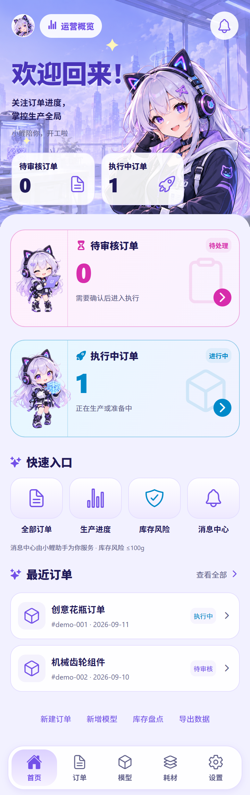
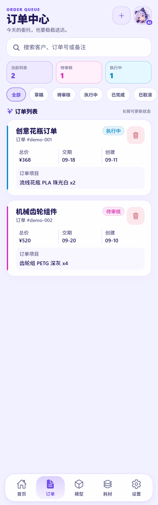
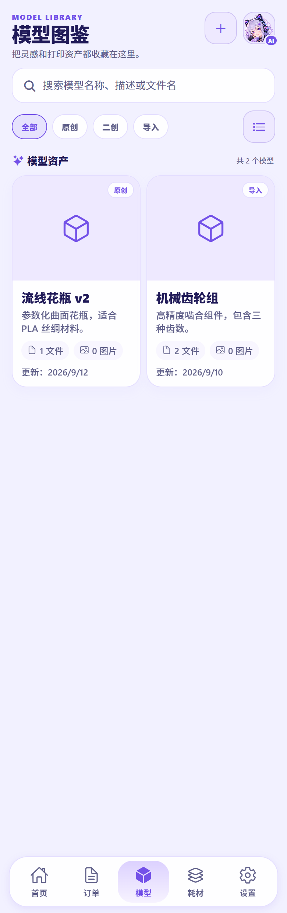

# 3D Manage

面向小型 3D 打印工作室的订单、模型与耗材运营管理系统。

3D Manage 由两部分组成：用户安装 **Expo / React Native 客户端**，团队在自己的电脑或服务器上运行 **Express 后端**。客户端首次打开时填写服务器地址，因此同一安装包可以连接不同的客户环境。

> 想直接部署？请跳到[选择部署方式](#选择部署方式)。第一次部署完成后，还需要在客户端[初始化 Owner](#连接客户端并初始化-owner)。

## 能做什么

| 模块 | 能力 |
| --- | --- |
| 订单 | 创建订单、查询筛选、状态流转、回收站恢复 |
| 模型 | 管理模型资料、图片和受保护附件 |
| 耗材 | 管理耗材、批次、入库、出库与库存调整 |
| 团队 | Owner、Staff、Viewer 分级权限 |
| 追溯 | 记录订单、模型、耗材和库存操作的审计信息 |
| 小鲤助手 | 可选 AI 对话、业务查询、图片理解与草稿确认 |
| 文件 | 默认保存到本地，也可由后端配置 OSS |

系统没有公开注册入口。首位 Owner 使用一次性初始化令牌创建账号，之后由 Owner 创建其他成员。

## 选择部署方式

| 你的场景 | 推荐入口 | 说明 |
| --- | --- | --- |
| Windows 10/11，想少敲命令 | [Windows 一键部署](#windows-一键部署) | 自动准备配置、启动 Docker 后端并设置登录后自启动 |
| x86_64 Linux 服务器 | [Docker Compose 部署](#x86_64-linux--docker-部署) | 适合局域网或配置 HTTPS 后用于公网 |
| 修改源码或调试功能 | [本地开发](#本地开发) | 启动 Expo Web 与文件存储后端 |

生产部署和本地开发是两套用途不同的运行方式。生产环境应使用 Docker Compose、PostgreSQL、独立密钥和持久化目录，不要把开发数据目录直接当作生产环境。

## 获取客户端

[GitHub Releases](https://github.com/GuideSword/3D-Manage/releases) 当前没有发布内容，项目目前尚未公开发布经过生产验收的客户端安装包。仓库记录中提到的签名预览包仅供内部测试，不应作为生产版本分发或使用。完成真机安装与覆盖升级验收后，正式客户端才会从 GitHub Releases 发布。

如果已按前文部署后端，可以在项目根目录运行 `npm install`，再执行 `npm run web`；使用 Web 前，须将 `http://localhost:8081`（或实际 Web 地址）作为精确 Origin 加入后端 `.env` 的 `CORS_ORIGINS`，多个来源用逗号分隔，然后按原部署方式重新创建服务：普通部署运行 `docker compose up -d`，HTTPS overlay 运行 `docker compose -f compose.yaml -f compose.https.yaml up -d`。也可以执行 `npm start`，用安装了 Expo Go 的手机扫码打开，然后连接已部署的后端；Expo Go / Native 客户端没有浏览器 Origin，不需要添加该项。如果需要前后端完整本地体验，请先运行 `npm install` 和 `npm --prefix backend install`，再按[本地开发](#本地开发)说明执行 `npm run start:all`。这些方式都属于开发或体验流程，不是生产客户端发布方式。

维护者如需构建 Android 安装包，请参阅[本地开发](#本地开发)中的 EAS 构建命令；这些命令仅供拥有 Expo 项目配置权限的维护者使用。

<details>
<summary>界面预览</summary>

<p align="center">
  
  
  
</p>

</details>

## Windows 一键部署

适合第一次部署的 Windows 用户。脚本只部署 Docker 后端，不安装或启动 Expo 客户端。

### 准备

- Windows 10/11 x64，并已启用虚拟化；
- [Node.js 20 或更高版本](https://nodejs.org/)；
- 将完整项目下载或克隆到本机，进入项目根目录；
- 如果尚未安装 Docker Desktop，请确保系统可以使用 `winget`。安装脚本会尝试安装当前稳定版；如果安装后暂时找不到 `docker.exe`，注销或重启 Windows 后重新运行即可。

### 部署步骤

1. 双击项目根目录的 `一键安装并启动后端.bat`。
2. 等待脚本启动 Docker Desktop、生成 `.env`、构建镜像并确认 `db` 与 `app` 容器健康。
3. 记下成功信息中的本机或局域网地址。默认地址是 `http://本机IP:5800`。
4. 双击 `获取初始化令牌.bat`。令牌会显示并复制到剪贴板。
5. 打开客户端，按[连接客户端并初始化 Owner](#连接客户端并初始化-owner)完成首次设置。

以后重启服务时，双击 `一键启动后端.bat`。首次安装脚本还会注册当前 Windows 用户登录后的自动启动任务。

如果 `5800` 端口已被占用，脚本会显示占用进程或容器，并让你选择清理占用方或改用其他端口。实际地址以脚本成功信息和 `.env` 中的 `APP_PORT` 为准。

## x86_64 Linux / Docker 部署

### 准备

- x86_64 Linux 主机；
- Docker Engine 与 Docker Compose v2；
- Node.js 20 或更高版本，仅用于首次生成安全配置；
- `curl`，用于部署后的健康检查；
- 建议先为应用预留约 1.5 CPU / 2 GB 内存，再根据上传文件大小和并发量调整。

先检查环境：

```bash
node --version
docker --version
docker compose version
curl --version
```

预期 Node.js 为 20 或更高版本，并且 `docker compose version` 显示 Compose v2。确认以上命令均可用后，在项目根目录运行：

```bash
node deploy/init-config.mjs
docker compose up -d --build
docker compose ps
curl http://localhost:5800/api/system/info
```

配置生成器会创建 `.env`，其中包含独立的数据库密码、JWT 密钥、AI 密钥加密密钥和一次性初始化令牌。为避免覆盖现有环境，已存在 `.env` 时生成器会直接退出。

健康接口应返回类似内容：

```json
{
  "product": "3D Manage",
  "serverId": "...",
  "apiVersion": "1"
}
```

查看首次初始化令牌：

```bash
grep '^BOOTSTRAP_TOKEN=' .env | cut -d= -f2-
```

默认端口是 `5800`。同一局域网中的客户端应填写服务器的局域网 IP，例如 `192.168.1.10:5800`，而不是客户端自己的 `localhost`。

### 公网 HTTPS

不要把明文 HTTP 后端直接暴露到公网。先让域名的 A/AAAA 记录指向服务器，再在 `.env` 中设置：

```dotenv
APP_DOMAIN=api.example.com
CORS_ORIGINS=https://app.example.com
```

`APP_DOMAIN` 是 Caddy 对外提供 API 的域名；`CORS_ORIGINS` 应填写实际 Web 客户端的来源（scheme、host 和 port），而不是 API 地址。Native 客户端不会发送浏览器 Origin；如果只使用 Native 客户端，可以将 `CORS_ORIGINS` 留空。

然后启动带 Caddy 的 HTTPS 配置：

```bash
docker compose -f compose.yaml -f compose.https.yaml up -d --build
```

Caddy 会自动申请和续期证书。完整网络、CORS 与 HTTPS 说明见[自托管部署文档](docs/SELF_HOSTING.md)。当前生产基线是单个应用副本；本阶段未验证 ARM64。

## 连接客户端并初始化 Owner

后端健康后，仍需在客户端完成一次初始化：

1. 打开已安装的 3D Manage 客户端。开发调试时也可以按[本地开发](#本地开发)启动 Expo 客户端。
2. 输入服务器地址：局域网可用 `192.168.1.10:5800`，公网使用 API 地址，例如 `https://api.example.com`。
3. 客户端确认服务器产品与 API 版本后，会进入初始化页面。
4. 填写组织名称、Owner 姓名、邮箱、密码、确认密码和部署初始化令牌。
5. 初始化成功后客户端会自动登录；在“设置 → 用户与权限”中创建 Staff 或 Viewer。

初始化令牌仅用于创建首位 Owner。它作为请求头发送，不会保存在客户端或业务数据中；系统初始化完成后，再次使用会被拒绝。

客户端连接不到服务器时，先在服务器上运行健康检查，再确认防火墙已开放实际的 `APP_PORT`。Native 客户端没有浏览器 Origin；Web 客户端的来源必须精确加入 `CORS_ORIGINS`。

## 本地开发

### 环境要求

- Node.js 20 或更高版本；
- npm；
- Windows PowerShell；
- Android 调试还需要 Android Studio、模拟器或安装了 Expo Go 的真机。

安装依赖并同时启动后端与 Expo Web：

```powershell
npm install
npm --prefix backend install
npm run start:all
```

也可以分别启动前后端。先在一个 PowerShell 终端运行文件存储后端：

```powershell
$env:JWT_SECRET = 'local-dev-jwt-secret-at-least-32-characters'
$env:AGENT_KEY_ENC_SECRET = 'local-dev-agent-key-secret-at-least-32-characters'
$env:BOOTSTRAP_TOKEN = 'local-dev-bootstrap-token-at-least-32-characters'
$env:STORE_DRIVER = 'file'
npm --prefix backend run store:init
npm --prefix backend run dev
```

再在另一个 PowerShell 终端启动客户端：

```powershell
npm start
# 或直接启动 Web
npm run web
```

以上密钥仅供本机开发，不要用于生产环境。首次初始化时，在客户端输入示例值 `local-dev-bootstrap-token-at-least-32-characters`；初始化完成后不再需要使用它。

启动成功后：

- Web 客户端：`http://localhost:8081`
- 后端健康检查：`http://localhost:5000/health`
- 首次初始化令牌：`start:all` 会显示在输出中；分别启动时使用上方设置的 `BOOTSTRAP_TOKEN`
- 日志：保存在 `.expo/` 与 `backend/` 下的启动日志文件中

`npm run start:all` 使用本地文件存储，并生成仅用于本机开发的随机密钥。它不会创建默认账号，也不等同于 Docker 生产部署。

常用前端命令：

```powershell
npm start
npm run web
npm run android
```

主要验证命令：

```powershell
npm run verify:client
npm run verify:agent-client
npm run verify:backend
npm --prefix backend run verify:self-hosted
```

拥有 Expo 项目配置权限的维护者构建 Android 安装包时可使用：

```powershell
npm run build:android:preview
npm run build:android:production
```

这两个命令依赖 EAS 登录状态和有权限的 Expo 项目配置，不是后端部署的前置步骤。

## 架构概览

```text
Expo / React Native 客户端
            │ HTTPS / HTTP（仅受信任局域网）
            ▼
       Express API
        ├─ PostgreSQL 16：账号与业务数据
        ├─ SQLite：小鲤 AI 会话与记忆
        ├─ runtime/uploads：本地附件
        └─ 可选外部服务：OpenAI 兼容模型 / OSS
```

| 角色 | 权限边界 |
| --- | --- |
| Owner | 全部业务操作、用户管理、系统配置和数据导入导出 |
| Staff | 查看并编辑日常订单、模型、耗材与库存，不能管理用户和系统 |
| Viewer | 只读查看业务数据 |

技术栈：Expo 54、React Native 0.81、React 19、Express 5、Node.js 22 容器、PostgreSQL 16、SQLite、Docker Compose，以及可选 Caddy HTTPS。

## 数据与安全

Docker 部署的数据保存在项目根目录的以下位置：

| 路径 | 内容 |
| --- | --- |
| `runtime/postgres` | PostgreSQL 业务数据 |
| `runtime/data` | AI SQLite 数据 |
| `runtime/uploads` | 本地上传文件 |

> **不要删除 `runtime/`。** 删除它会删除客户业务数据、AI 数据和本地附件。升级前应创建冷备份，并把三个目录作为同一个恢复点处理。

生产环境还应遵守以下规则：

- 不要提交 `.env`，也不要把 `JWT_SECRET`、`AGENT_KEY_ENC_SECRET` 或 OSS 密钥打包进客户端或下发给客户端；
- `BOOTSTRAP_TOKEN` 只在受信任客户端首次初始化时临时输入，不要预置在客户端，也不要长期保存；
- 将 `.env` 作为受限的独立恢复密钥包离线保存；
- 公网只使用受信任 HTTPS；
- `CORS_ORIGINS` 填写准确的 scheme、host 和 port，不要使用 `*`；
- 当前仅支持单个 `app` 副本，因为 AI SQLite 使用本地持久化目录。

备份和恢复步骤见[备份与恢复](docs/BACKUP_RESTORE.md)。

## 常用运维命令

```bash
# 查看容器状态
docker compose ps

# 查看后端最近 200 行日志
docker compose logs --tail 200 app

# 停止服务（保留数据）
docker compose stop

# 重新启动已有服务
docker compose start

# 检查 API 身份
curl http://localhost:5800/api/system/info
```

升级前请先阅读[升级运行手册](docs/UPGRADE.md)，不要使用会删除卷或 `runtime/` 的命令。

## 常见问题

### Docker 后端未启动或健康检查失败

先直接检查 API：

```bash
curl http://localhost:5800/api/system/info
docker compose ps
docker compose logs --tail 200 app
```

如果健康接口没有返回产品信息，根据容器状态和后端日志排查。Windows 用户还应确认 Docker Desktop 已启动并完成初始化。

### `5800` 端口被占用

Windows 一键脚本会引导处理冲突。手动部署时可以修改 `.env` 中的 `APP_PORT`，重新执行 `docker compose up -d`，然后在客户端使用新端口。

### 后端健康，但手机连接失败

不要在手机上填写 `localhost`。填写运行后端电脑的局域网 IP，并检查系统防火墙是否允许实际端口入站。

### Web 页面提示跨域或 Mixed Content

将 Web 页面的精确来源加入 `CORS_ORIGINS`。HTTPS 页面不能请求 HTTP API；两端都应使用 HTTPS。

### 忘记初始化令牌

Windows 运行 `获取初始化令牌.bat`；Linux 从受限的 `.env` 中读取 `BOOTSTRAP_TOKEN`。如果系统已经初始化，该令牌不能再次创建 Owner。

## 文档

- [自托管部署](docs/SELF_HOSTING.md)：生产环境、网络、HTTPS 和会话验收
- [升级运行手册](docs/UPGRADE.md)：安全升级步骤
- [备份与恢复](docs/BACKUP_RESTORE.md)：冷备份、恢复守卫与演练
- [发布检查清单](docs/RELEASE_CHECKLIST.md)：发布前自动与真机检查
- [后端说明](backend/README.md)：后端开发、验证与数据迁移
- [产品需求](需求文档.md)：MVP 范围、业务流程与数据模型

## 项目结构

```text
3D-Manage/
├─ screens/、components/、navigation/  # Expo / React Native 客户端
├─ backend/                            # Express API 与数据访问
├─ deploy/                             # 初始化、备份、恢复与 Windows 部署脚本
├─ docs/                               # 部署、运维、设计与发布文档
├─ runtime/                            # Docker 持久化数据（不要删除或提交）
├─ compose.yaml                        # PostgreSQL + 应用服务
└─ compose.https.yaml                  # 可选 Caddy HTTPS
```
