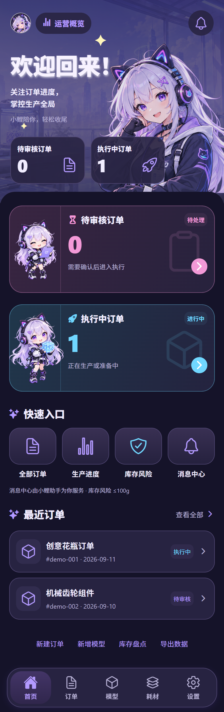

# “小鲤”赛博猫娘首页改版交接

> 交接日期：2026-09-13  
> 项目：3D-Manage（Expo / React Native）  
> 状态：首页样板已实现、自动化验证已通过、Android 预览 APK 已生成；尚未完成实体设备视觉验收和生产签名发布。

## 1. 本次任务的最终需求

用户确认按参考图改造前端，约束如下：

- 先只改首页作为视觉样板，其他业务页暂不整体重做。
- 尽量还原参考图的蓝紫色赛博二次元氛围、信息层级、粉蓝状态卡和悬浮底栏。
- 原助手“小麦”更名为“小鲤”，角色重新设计为原创蓝紫色赛博猫娘。
- 同时提供蓝紫日间版和深紫夜间版，沿用现有主题切换能力。
- 界面、文字、卡片、按钮、渐变和数据均使用 React Native 原生组件实现；角色使用透明 PNG 插画。
- 保留“最近订单”，其余首页结构尽量贴近参考图。
- 不改后端接口、权限模型、订单状态、业务数据或既有路由名称。

详细设计见：

- [设计说明](../superpowers/specs/2026-09-11-cyber-xiaoli-home-redesign-design.md)
- [实施计划与验证记录](../superpowers/plans/2026-09-11-cyber-xiaoli-home.md)

## 2. 已完成内容

### 首页视觉与结构

- 新增蓝紫渐变主视觉区，包含“小鲤”、运营概览、欢迎文案、通知入口和订单概览。
- 新增“待审核订单”和“执行中订单”两张粉色/蓝色业务状态大卡。
- 新增四项快速入口：全部订单、生产进度、库存风险、消息中心。
- 保留并重做“最近订单”，最多显示四条，支持进入订单详情。
- 新增悬浮胶囊式五项底部导航：首页、订单、模型、耗材、设置。
- 日间、夜间以及 390px / 320px 窄屏布局均已生成验证截图。

### 数据、导航与权限

- 首页继续读取现有待审核、执行中、最近订单和库存接口。
- 订单计数优先使用接口的 `total`，避免只统计当前分页。
- 各模块使用 `Promise.allSettled`，单个接口失败时其余模块仍可显示，并提示“部分数据加载失败”。
- 使用请求代次避免页面失焦后旧请求覆盖新状态。
- `homeRequest` 时间戳保证从首页重复点击相同筛选时，订单页或耗材页仍会重新应用参数。
- 新建、盘点、导出等写操作继续由原有 `canWrite` / `canExport` 权限控制。
- 首页已有两个“小鲤助手”入口，因此隐藏首页原全局悬浮助手按钮；其他页面仍保留。

### 品牌文案

- 本次涉及的首页、AI 助手、模型空状态和耗材空状态中的“小麦”已替换为“小鲤”。
- 未执行全仓库无差别替换；后续若继续扩展全站，需要重新检索旧名称并结合语境处理。

## 3. 关键文件

| 文件或目录 | 作用 |
| --- | --- |
| `components/home/CyberHome.js` | 首页全部展示组件、卡片、快捷入口、最近订单及响应式样式 |
| `components/home/theme.js` | 首页独立的日间/夜间蓝紫主题令牌 |
| `screens/HomeScreen.js` | 首页数据读取、刷新、错误隔离、权限和导航回调 |
| `navigation/CyberTabBar.js` | 自定义悬浮胶囊底栏 |
| `navigation/TabNavigator.js` | 接入 `CyberTabBar`，首页隐藏重复标题 |
| `App.js` | 首页隐藏全局助手悬浮按钮 |
| `screens/OrdersScreen.js` | 响应首页传入的订单状态和 `homeRequest` |
| `screens/MaterialsScreen.js` | 响应库存入口传入的页签和 `homeRequest` |
| `screens/AgentChatScreen.js` | 助手名称和欢迎文案改为“小鲤” |
| `screens/ModelsScreen.js`、`screens/MaterialsScreen.js` | 空状态文案改为“小鲤” |
| `assets/xiaoli/` | 主视觉、两张 Q 版动作图、工坊背景和素材说明 |
| `tests/client/home-ui.smoke.cjs` | 首页浏览器交互、主题、窄屏、部分失败和重试的冒烟测试 |
| `package.json`、`package-lock.json` | 新增 `expo-linear-gradient` 依赖 |

## 4. 插画资源

`assets/xiaoli/` 当前包含：

- `hero.png`：顶部半身主视觉。
- `review.png`：待审核订单卡 Q 版动作。
- `production.png`：执行中订单卡 Q 版动作。
- `workshop.png`：低对比度工坊背景。
- `README.md`：素材用途和生成说明。

三张角色图均已确认包含透明通道。界面文字和业务数据没有烘焙到插画中，可继续动态更新和本地化。

## 5. 视觉参考与当前实装截图

日间版：


夜间版：



窄屏截图：

- [日间 320px](../ui-concepts/xiaoli-home-light-narrow.png)
- [夜间 320px](../ui-concepts/xiaoli-home-dark-narrow.png)

这些截图来自拦截式演示 API，不包含或改写真实服务数据。

## 6. 已完成验证

本次执行并通过：

```powershell
npm run verify:client
npx expo export --platform all --output-dir .tmp/xiaoli-export
node tests/client/home-ui.smoke.cjs
```

结果摘要：

- `npm run verify:client`：8 项通过。
- Expo Web、Android、iOS 静态导出通过。
- 日间、夜间、390px、320px 截图通过。
- 验证了订单数量、生产进度筛选、全部订单重置、库存入口、部分接口失败不误报为 0、下拉重试恢复。
- 验证过程中未发现页面运行时异常。

注意：静态导出和浏览器冒烟测试不等同于 Android / iOS 真机视觉验收。

## 7. Android 预览包

已生成本地预览 APK：

`output/releases/3D-Manage-xiaoli-preview-v1.0.0.apk`

产物信息：

- 包名：`com.anonymous.x3DManage`
- 版本：`1.0.0`（versionCode 1）
- minSdk：24
- targetSdk：36
- 文件大小：104,734,235 bytes（约 99.88 MB）
- SHA-256：`ACCC44EA14E67F2489426D7736EB5DF2BD69A8E060BF395ED3C69C8F2FBABF0C`
- APK v2 签名校验通过。

该包通过本地 Gradle 构建，没有向 Expo EAS 上传项目源码。它使用 Android Debug 证书签名，仅用于预览和内部测试，不能作为应用商店正式发布包。如果设备上已有同包名但签名不同的版本，安装时可能需要先卸载旧版本。

本机成功构建时使用的环境：

```powershell
$env:JAVA_HOME='D:\JDK\JDk17'
$env:ANDROID_HOME='D:\SDK\SDK'
$env:ANDROID_SDK_ROOT='D:\SDK\SDK'
$env:NODE_BINARY='C:\Program Files\nodejs\node.exe'
Set-Location .\android
.\gradlew.bat assembleRelease --no-daemon
```

`android/` 是 Expo prebuild 生成目录且已被 `.gitignore` 忽略。如果新环境没有该目录，先在项目根目录执行：

```powershell
npx expo prebuild --platform android --no-install
```

不要把当前预览签名当作生产签名。正式分发前应配置独立 keystore、备份凭据并重新构建。

## 8. 当前工作区注意事项

- 本次首页改版尚未形成独立提交，相关文件仍与工作区其他改动混在一起。
- `docs/superpowers/plans/2026-09-08-self-hosted-distribution-phase-one-implementation.md` 和 `docs/superpowers/specs/2026-09-08-self-hosted-distribution-phase-one-design.md` 当前也有修改，它们属于自托管分发工作，不应在整理首页改版提交时误覆盖或丢弃。
- `android/` 为忽略的生成目录；其中为本机打包做过的生成态调整不是可维护源码。需要复现时应以 Expo 配置和上述命令为准。
- `output/releases/` 中的 APK 体积较大。提交 Git 前需要明确仓库是否希望追踪二进制产物；不要默认加入提交。
- 不要执行 `git reset --hard`、`git clean` 或整仓覆盖操作，当前工作区存在用户的其他未提交成果。

## 9. 尚未完成与建议接续顺序

### 必做验收

1. 在 Android 实机安装预览 APK，检查安全区、长屏滚动、底栏、文字清晰度和图片裁切。
2. 使用真实后端分别验证管理员、操作员和只读用户的入口权限。
3. 验证真实订单较多、空列表、超长客户名、接口超时和离线场景。
4. 在设置中切换日间/夜间主题，确认返回首页后状态和布局稳定。

### 可能的下一阶段

1. 根据用户实机反馈微调首页间距、字号、角色占比和粉蓝光效。
2. 用户确认首页风格后，再按同一视觉语言逐页扩展订单、模型、耗材和设置页。
3. 将“小鲤”品牌文案和插画使用规范集中成全局设计令牌或品牌组件，避免后续页面各自复制。
4. 配置正式 Android applicationId、图标、启动图、版本策略和生产签名，再生成可分发安装包。

## 10. 下一位接手者的快速检查清单

开始工作前：

```powershell
git status --short
npm run verify:client
```

接着重点阅读：

1. 本交接文档。
2. `docs/superpowers/specs/2026-09-11-cyber-xiaoli-home-redesign-design.md`。
3. `screens/HomeScreen.js` 与 `components/home/CyberHome.js`。
4. `navigation/CyberTabBar.js`。
5. `tests/client/home-ui.smoke.cjs`。

修改完成后至少重新执行客户端验证、三平台静态导出和首页冒烟测试；涉及 Android 原生配置时，再重新生成并安装 APK 验收。
